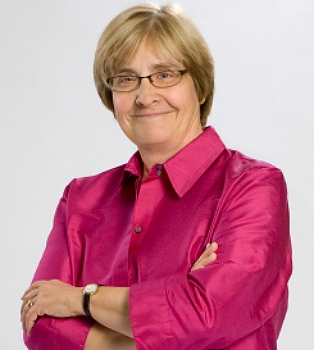
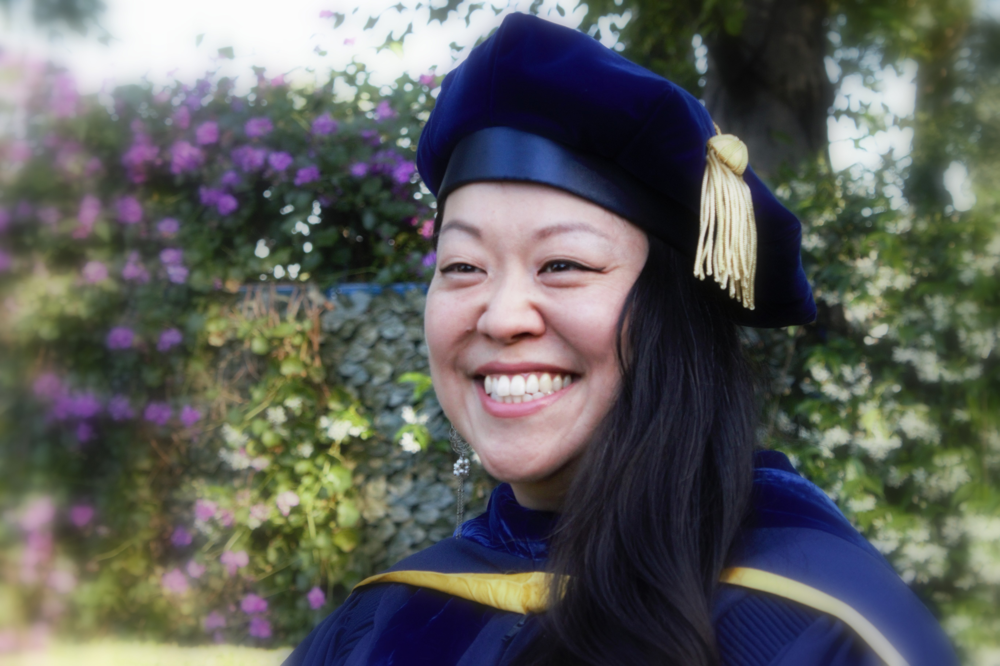
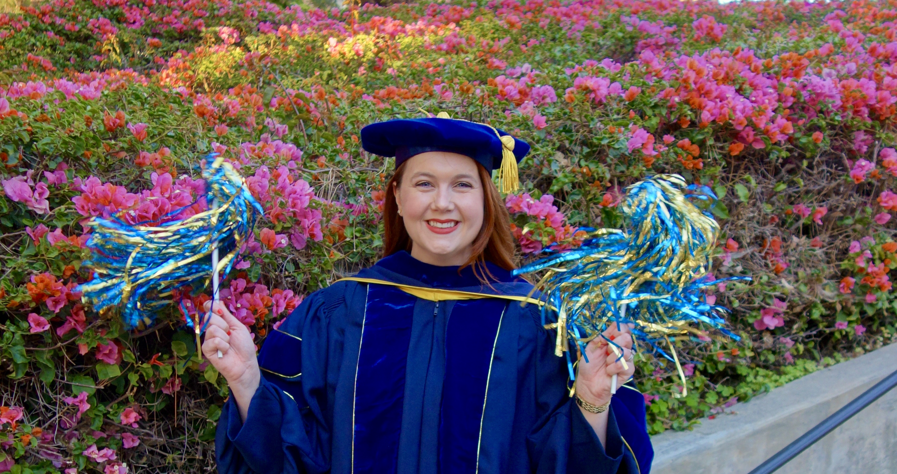

## Speakers

--- .speaker .tall

# Professor Patricia McDonough, HEOC Division Head

*** =info

---

## Master of Arts in Education

--- &twocol .gold .tall

# Amanda Carrasco, M.A.

### Advisor: Sylvia Hurtado 

*** =left

*** =right

Quiero agradecer a toda mi familia, amigxs, compañerxs y mentores por todo su apoyo a lo largo de mi maestría. Estoy muy agradecida de tener la oportunidad de seguir mis pasiones y poder seguir estudiando. Me siento muy…excited!

--- &threecol .gold

# Harmeet Kaur Kalsi, M.A.

### Advisor: Linda Sax

*** =left

*** =middle

*** =right

Every great dream begins with a dreamer. Always remember, you have within you the strength, the patience, and the passion to reach for the stars to change the world.

- Harriet Tubman

Thank you to each person who has supported my dream to change the world. Let us remain hopeful and resilient so we continue to make positive transformations to this world.

--- .speaker .gold .tall

# N. Angie Jaimez Noel, M.A.

### Advisor: Sylvia Hurtado

*** =info

--- &twocol .gold

# Brianna Wright, M.A.

### Advisor: Cecilia Rios-Aguilar

*** =left

*** =right

I am infinitely grateful for the many people who have played a role in my educational journey. Thank you to my community, professors, friends, abuelos, and of course my wonderful mom and dad.

--- .info

# Master of Arts in Education

  

**Andre Le Thai Trong Nguyen, M.A.**

Advisor: Mitchell Chang

 

**Hae Rim (Grace) Shin, M.A.**

Advisor: Cecilia Rios-Aguilar

 

**Diondraya Christine Taylor, M.A.**

Advisor: Linda Sax

---

## Doctor of Philosophy in Education

--- &twocol .gold .tall

# Jenny Jong-Hwa Lee, Ph.D.

### "Going Global" at Home: International Branch Campuses, Im/Mobilities, and the Tensions of Class and Language Chair: Mitchell Chang

*** =left

*** =right

My PhD journey has spanned over a decade and has been one of the most arduous treks of my life, from the loss of three loved ones, divorce, depression, and a transpacific move. According to Maya Angelou, "You may encounter many defeats, but you must not be defeated. In fact, it may be necessary to encounter the defeats, so you can know who you are, what you can rise from, how you can still come out of it." I am eternally grateful for my family and friends who helped me rise despite all the odds. I love you all.

--- &twocol .gold .speaker

# Austin Lyke, Ph.D.

### Horizontal Stratification in the City: Field of Study, Gentrification, and the Social Topography of Los Angeles Chair: Cecilia Rios-Aguilar

*** =left

*** =right

--- &threecol .gold

# Hope Katherine McCoy, Ph.D.

### Soft Power & Education: Russian Cultural Centers on the African Continent Chairs: Walter Allen & Robert Rhoads

*** =left

*** =middle

Slow and steady wins the race!

*** =right

--- &threecol .gold

# Destiny McLennan, Ph.D.

### "We Just Find Ways to Survive": Identity and Asset-Based Decision-Making Processes Among Black Youth in an AntiBlack Reality Chair: Cecilia Rios-Aguilar

*** =left

*** =middle

I can't believe I've made it to where I am today. As one of my participants said, "surviving isn't the exact same as thriving, surviving isn't the same as being healthy. But when you come from communities that have experienced generations of marginalizing, it's like a constant struggle." To come from where I come from and have experienced all that I have, I couldn't be more proud of my accomplishments, and more ready to continue serving my community. Thank you to my village for getting me here. Huge thank you to my mom and little brother who continue to support and inspire me everyday. I appreciate and love you both so much.

*** =right

--- .gold .tall .flex-invert

# Kaitlin Newhouse, Ph.D.

### Race & Class in the College Classroom: Faculty interactions and student learning among racially diverse poor and working-class collegians Chair: Linda Sax

*** =info

Like every good or interesting or important thing I have ever done, this accomplishment was only possible because of the people who love me so well. Thank you. I love you. I owe you big time. We did it.

--- .speaker .gold .tall

# Hector Vicente Ramos, Ph.D.

### Thesis Title Chair: Sylvia Hurtado

*** =info

--- &threecol .gold

# Annie M. Wofford, Ph.D.

### Rewriting the Script for Equity-Minded Graduate School Pathways: Examining Mechanisms of Mentoring and Psychosocial Development in Computing Disciplines Chair: Linda Sax

*** =left

*** =middle

As a collective effort with a solitary name, I am forever grateful for the power of community in helping me reach this Ph.D. milestone. Many thanks to the most amazing partner (Ryan), my family, incredible friends and colleagues in HEOC and beyond, as well as my faculty advisor (Linda) and dissertation committee members for their unending support.

*** =right

--- .info

# Doctor of Philosophy in Education

  

**Kapua Lililehua Chandler, Ph.D.**

Thesis Title

Chair: Mitchell Chang

 

**Daniel Harris, Ph.D.**

Thesis Title

Chair: Walter Allen

 

**Chantal Jones, Ph.D.**

Thesis Title

Chair: Walter Allen

 

**Edgar Romo, Ph.D.**

Thesis Title

Chair: Kevin Eagan

--- .title .credit

# Congratulations Graduates!

    
  

    
  

    
  

    
  

    
  

    
  

    
  

    
  

    
  

    
  

    
  

    
  

    
  

    
  

    
  

    
  

    
  

    
  

<audio loop data-autoplay>
  <source src="./assets/audio/pomp-and-circumstance.mp3" type="audio/mpeg">
</audio>

---

  
  

  Created using R/RStudio
    
  <a href="https://github.com/ozanj/heoc21grads" target="_blank">github.com/ozanj/heoc21grads</a>

